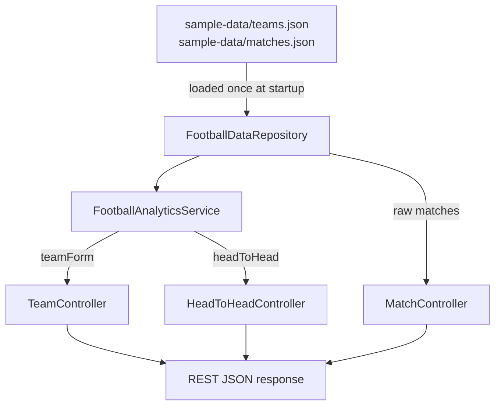

# Architecture

## Components

| Component                  | Responsibility                                                        |
|-----------------------------|-------------------------------------------------------------------------|
| `FootballDataRepository`    | Loads `sample-data/*.json` once at startup, serves it from memory      |
| `FootballAnalyticsService`  | Pure business logic: form aggregation, head-to-head, insight sentences |
| `TeamController`            | `/api/teams`, `/api/teams/{id}/form`                                   |
| `MatchController`           | `/api/matches`, `/api/matches/team/{id}`                               |
| `HeadToHeadController`      | `/api/head-to-head`                                                    |
| `GlobalExceptionHandler`    | Maps `NoSuchElementException` → 404, `IllegalArgumentException` → 400  |

## Data Flow



### ASCII fallback

```
teams.json + matches.json
        |
        v
FootballDataRepository  (in-memory, loaded once)
        |
        v
FootballAnalyticsService
   |            |
   | teamForm   | headToHead
   v            v
TeamController  HeadToHeadController
   |
   v
MatchController (raw match listing)
```

## Important Interfaces

- `FootballDataRepository.findTeamById`, `.findMatchesForTeam`, `.findMatchesBetween`
  are the only seams the service depends on — swapping in a database-backed
  repository later would not require changing `FootballAnalyticsService`.
- All models are Java records (`Team`, `MatchResult`, `TeamFormSummary`,
  `TeamFormEntry`, `HeadToHead`) — immutable, no setters, safe to serialize
  directly as JSON.

## External Dependencies

- Spring Web, Spring Validation (runtime)
- Spring Boot Test (JUnit 5, Mockito, AssertJ — test scope only)
- No database, no external HTTP calls, no AI/LLM dependency

## Decision Points

- **Where form windowing happens**: inside `FootballAnalyticsService`, not the
  controller — keeps the controller a thin HTTP adapter and the windowing
  logic unit-testable without Spring.
- **Where insight thresholds live**: as named private methods
  (`buildFormInsights`, `buildHeadToHeadInsights`) rather than inline in the
  aggregation loop, so they can be tuned or tested independently.
